# GeoSkill

**Writeup by:** briatlon for [0-Day Aarhus](https://ctftime.org/team/251818/) · **Event:** [0xFUN CTF 2026](https://ctftime.org/ctf/1475/) · **Solves:** ~18 · **Challenge Author:** acni

## Challenge description

> 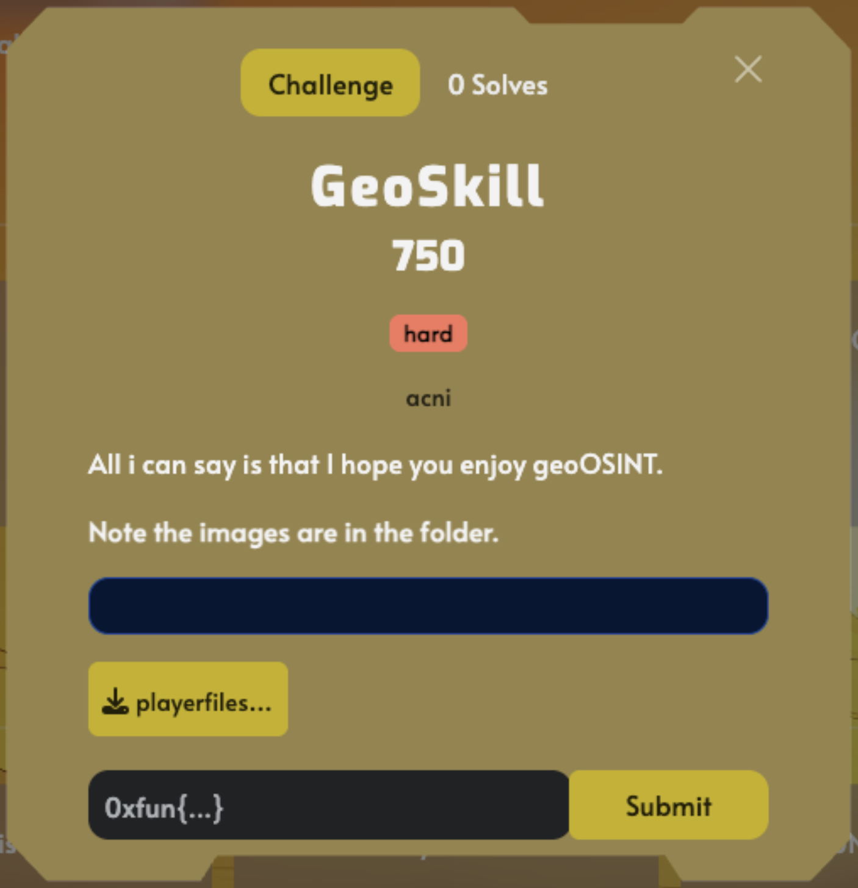

## Note about the CTF infrastructure

When we initially got access to the challenge at the beginning of the CTF, it had major server issues. This meant that the blue box you see in the screenshot above was blank and not clickable. We learned later that it hosted an instance, where we could submit the locations and receive hints, but more on that later...

We were able to download a folder with 7 images. All answers were submitted in Title Case (`Capitalize Every Word`) and replaced spaces with `_`.

## Solve

### Location 1

**Prompt:** Name the country this statue/location is in.

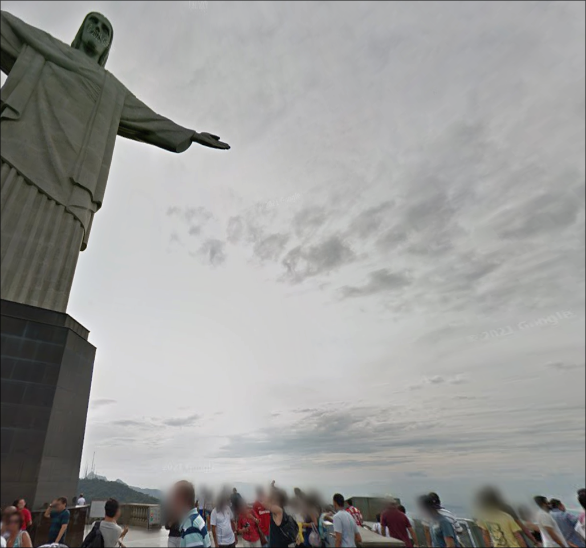

Easy first location. Confirmed location with a quick Google search. "Jesus statue" known as [Cristo Redentor](https://maps.app.goo.gl/dDLiNjyL5mfWtfbN6). 

> Location: `Brazil`

### Location 2

**Prompt:** Identify the city where this photo was taken.
**Difficulty:** Easy

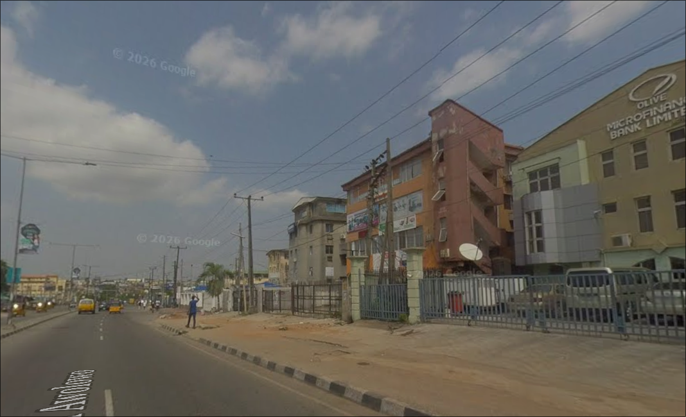

From the image we can see “AWOLOWO” on the road and a quick Google reverse image search gave this location for [Olive Microfinance Bank Limited](https://www.google.com/maps/search/olive%20microfinance%20bank%20limited.%20nigeria%20Awolwo).

> Location: `Lagos`

### Location 3

**Prompt:** Name the island this photo is located on.
**Difficulty:** Easy

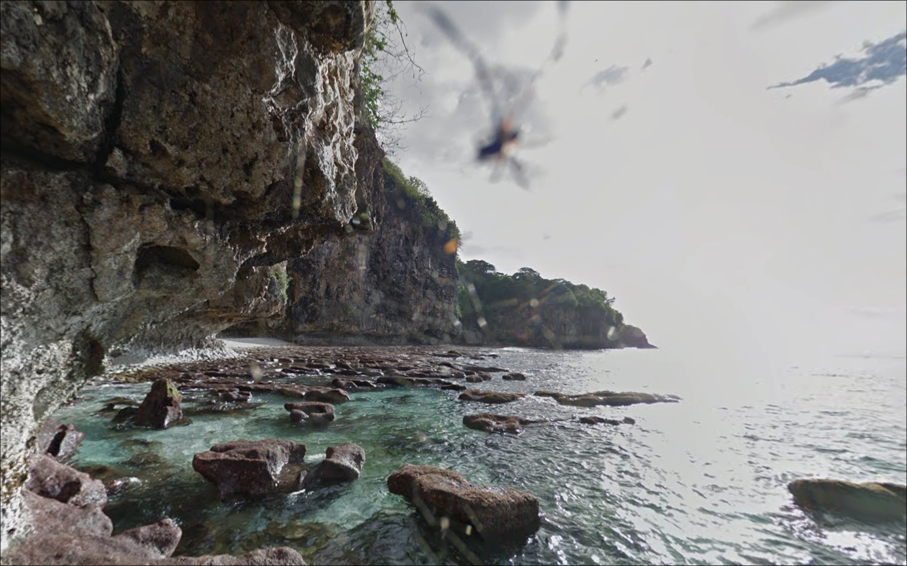

Another quick guess, this one solved by my team member `@Luccas`. We had some ideas of where the exact location of the image was taken, but we didn’t know how precise we had to be. Since we had all 7 images provided from the start, we kept moving on to the other locations and did precise geolocations there.

> Location: `Christmas_Island`

### Location 4

**Prompt:** Identify the Japanese prefecture this photo is located in.
Hint: You do not need the text in the image to solve this, nor the exact location.
**Difficulty:** Medium

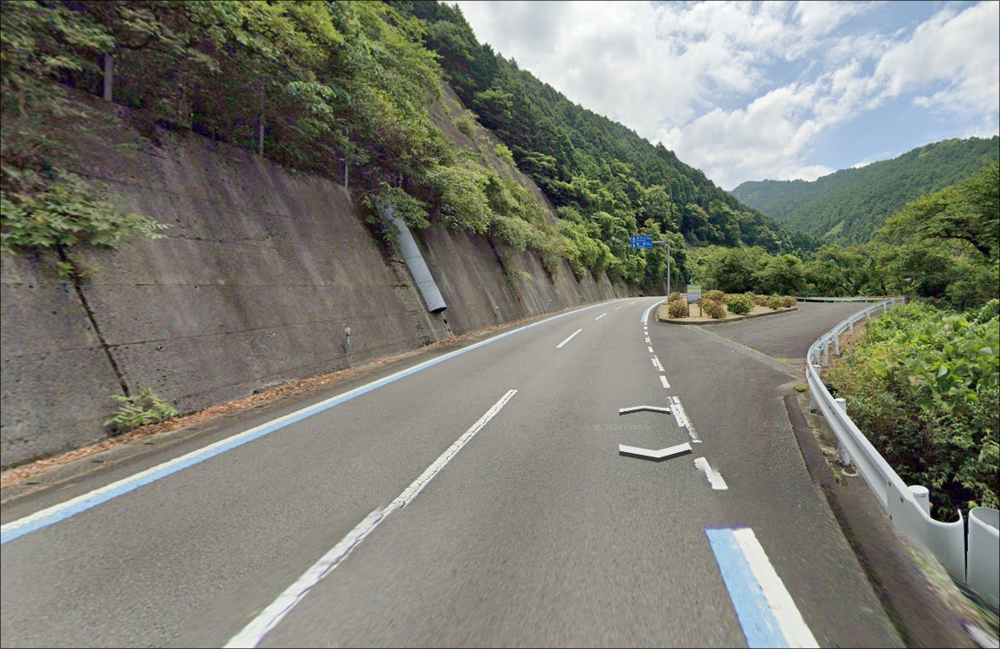

This location was reverse image searched and an AI result gave the following: *“The image is of Japan National Route 194, a national highway located on the island of Shikoku in Japan. This route connects Kōchi Prefecture and Ehime Prefecture.”*. Could have done a more in-depth deep dive on this one to confirm or deny the route, but trust me, it was smart to save some energy for the later tasks. Eventually tried both prefectures, Ehime worked.

> Location: Ehime

### Location 5

**Prompt:** Name the street this photo is located on. The answer is one word as listed on Google Maps.
**Difficulty:** Hard


This was where it started to get really interesting. Note that we didn’t solve the challenges chronologically up until this point. We had been given all of the images and didn’t know if they were all going to be needed in that order or how precise we had to be. But again we started with a reverse image search and it pointed us towards Denmark. That was especially interesting for us. Why you might ask? Well.. 

Our team is Danish 🇩🇰 and after letting the image go around the table we could pretty much all confirm that this could be somewhere in Denmark. The nature and the small pole on the right path is something that is very familiar to Danish forest trails. We confirmed that the image was taken in 2018 from the water mark and started focusing on the car. I found this image when searching for Google Street View cars. 

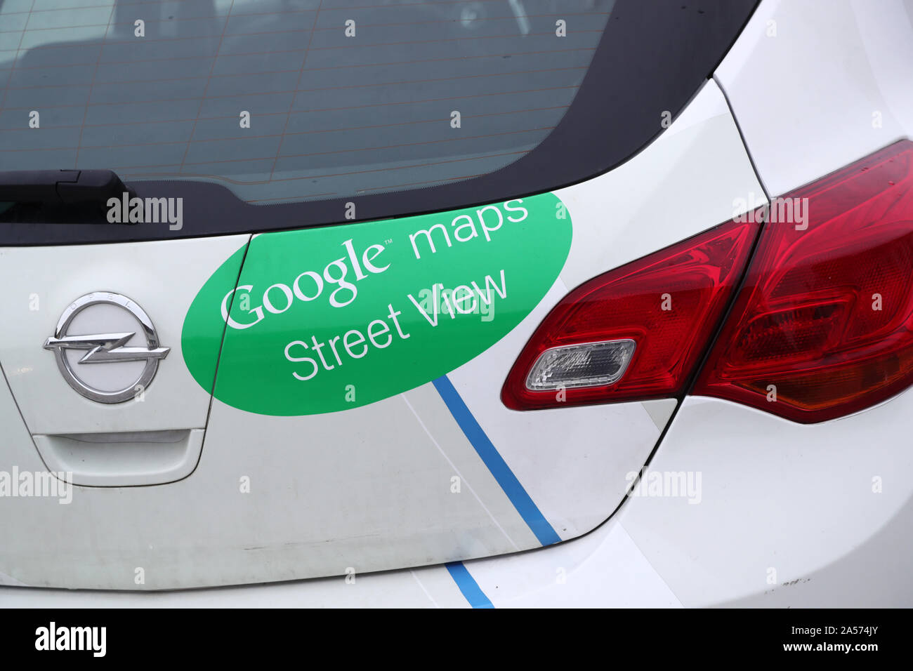

That gave us the model and ultimately led us to [this site](https://geohints.com/meta/googleVehicles/cars). Searching for Denmark gave us these options:

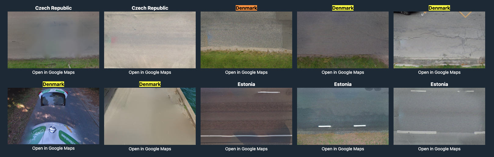

Dropping down on the map landed us on the right road, very close to [the correct location](https://www.google.com/maps/@55.5084756,9.7140551,3a,75y,287.38h,83.07t/data=!3m7!1e1!3m5!1sleiqVHhlrMBmJV3G_IPzKg!2e0!6shttps:%2F%2Fstreetviewpixels-pa.googleapis.com%2Fv1%2Fthumbnail%3Fcb_client%3Dmaps_sv.tactile%26w%3D900%26h%3D600%26pitch%3D6.9262993436325075%26panoid%3DleiqVHhlrMBmJV3G_IPzKg%26yaw%3D287.3800483905971!7i13312!8i6656?entry=ttu&g_ep=EgoyMDI2MDIxNy4wIKXMDSoASAFQAw%3D%3D), confirmed by `@sibech`.

> Location: Kongebrovej

### Location 6

**Prompt:** Find the exact what3words for this spot.
You can find the what3words for an exact coordinate at https://what3words.com

```
Three words separated with periods, no leading ///
Example: muggles.pursues.dispose
```

*The original photo was first fed to Nano Banana Pro, then ChatGPT 5.2 Thinking
with the same prompt: "Recreate this image in AI, but cartoony style"*


#isthistheGRANDfinale?
**Difficulty:** Hard

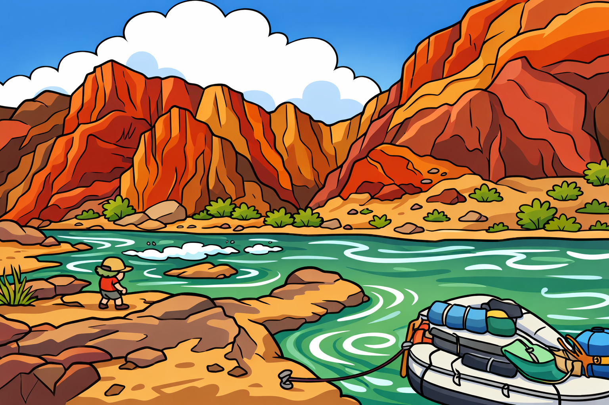

Here is where it got spicy. 

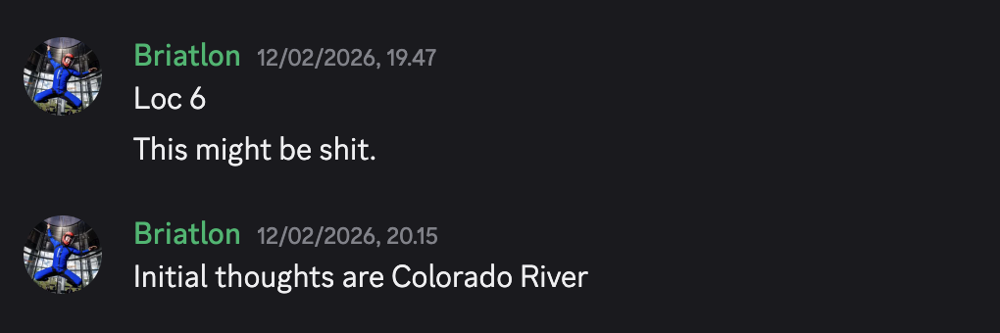

We had initially assumed that this spot might be hard to find, since it would be hard to know exactly how much the AI had distorted the image and how similar the actual location would be. We agreed it looked like Grand Canyon, but initial Street View searches focused on raft docking stations. After checking the most obvious points of interest without success, we tried to ask ChatGPT to reimagine what the photo could have originally looked like. 

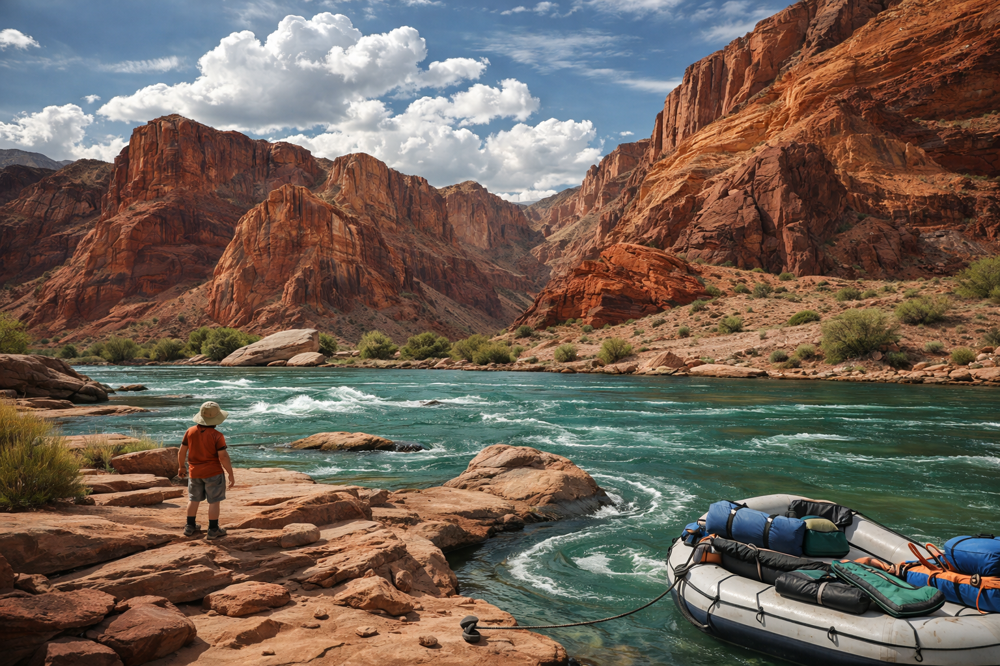

I took this challenge on my shoulders while the rest of the team looked at other challenges. I decided it would be a good idea to focus on the guy in the red shirt and the raft. I also noticed the green water and the clouds above the mountains - this would all later on lead to my eventual demise.

With no initial progress on nailing down the point, I decided to go with a systematic approach. I knew that the spot would have to be a panorama on the coast side of the river and not a part of the raft line on Street View. I then started from the westernmost point of the Colorado River and started following the river inspecting every small dot that was a panorama somebody had uploaded to Google.

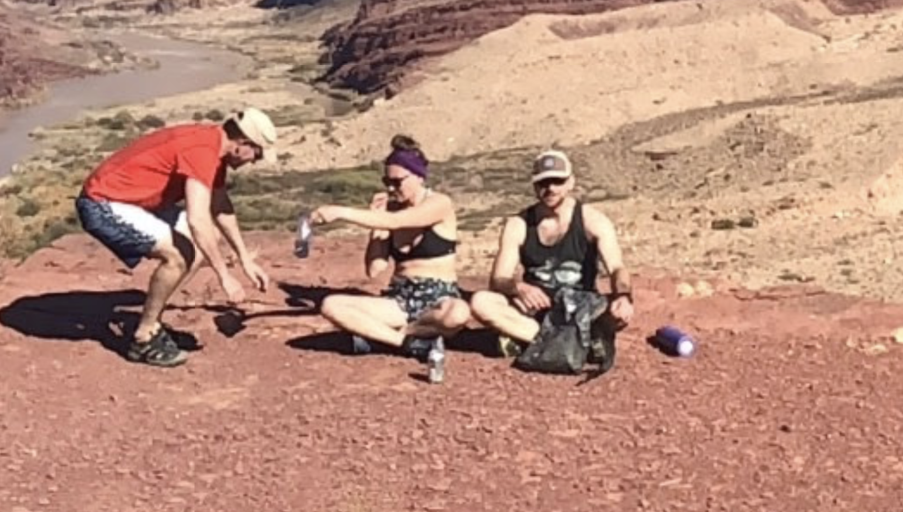

I started noticing men with red shirts and caps, a lot like what I’d seen on the challenge picture.


People lying on cliff sides.

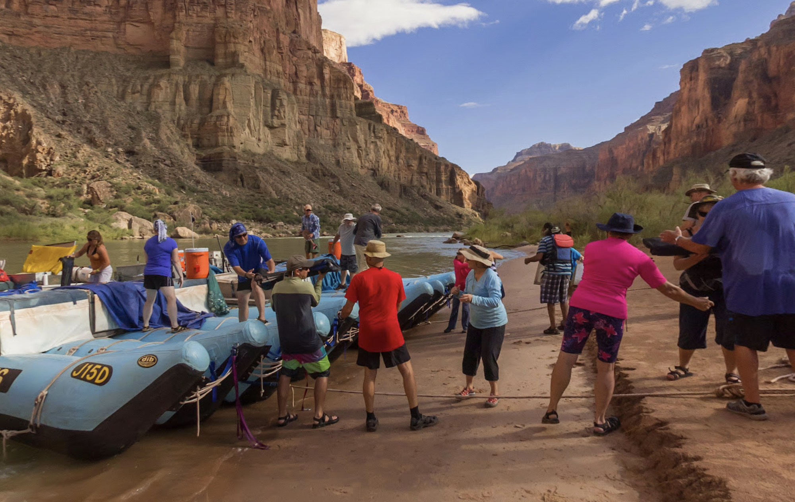

In bigger crowds.

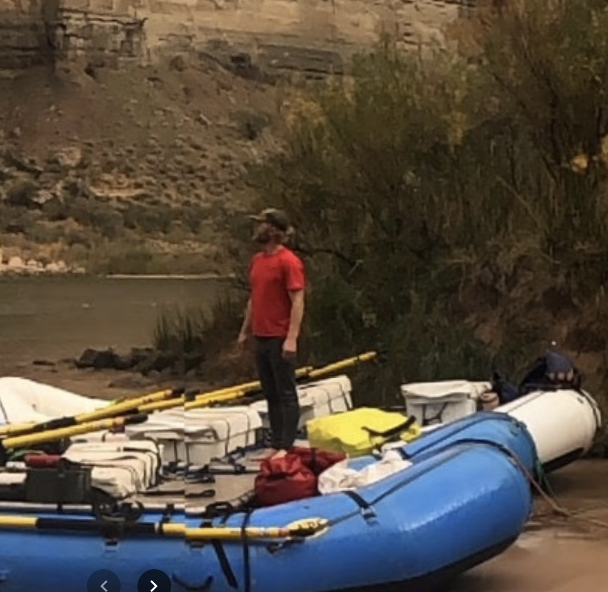

Ready to board a raft. And it was at this point late into the night that I decided that I might just check how long the Colorado River actually was. Turns out it’s 1,450 miles (2,330 km) and I got to explore **every little corner of it**.

I kept going in the hope that I would eventually find something that matched well enough to be what I had seen on the picture. And then it finally appeared. Right at [this location](https://www.google.com/maps/place/Redwall+Cavern/@36.365239,-111.887644,3a,69.2y,290.37h,101.37t/data=!3m8!1e1!3m6!1sCIHM0ogKEICAgIC6zobtbw!2e10!3e11!6shttps:%2F%2Flh3.googleusercontent.com%2Fgpms-cs-s%2FAFfmt2b1u8ta2f75IhRChWmRfu1YWKFlruLYz5RABi47Kl6Z9JjJKF9UmI6dhU3nVooqHUyIJe4d1sZFHYEal80407JAn57h6S_xfc67bgKQzk-BNnKTAJohRoPZfFgLjsJWxhUfYWHG%3Dw900-h600-k-no-pi-11.371332454791656-ya290.3725232110241-ro0-fo100!7i10740!8i5370!4m16!1m8!3m7!1s0x80cc0654bd27e08d:0xb1c2554442d42e8d!2sGrand+Canyon!8m2!3d36.0997631!4d-112.1124846!10e5!16zL20vMGNuczU!3m6!1s0x873383783ff2ad0b:0x3d41a42743244251!8m2!3d36.4913447!4d-111.839696!10e5!16s%2Fg%2F11f6g5sytv!5m2!1e2!1e4?entry=ttu&g_ep=EgoyMDI2MDIxNy4wIKXMDSoASAFQAw%3D%3D) was a spot that matched all of the features.

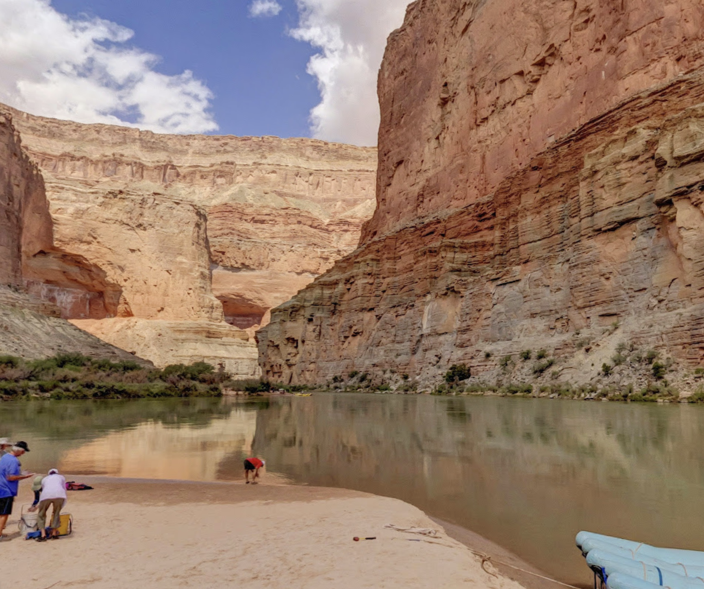

The more I look at the image, the more similarities start to appear. The man with the red shirt and whitish cap slightly bent over. The green water. The clouds and the mountains. The raft tied to the shore. And the green vegetation close to the water. This had to be it. Or so I thought...

I tried to input the location into what3words, but the server wouldn’t accept it. I even had to open a ticket to make sure I wasn’t doing something wrong, also knowing that the location had to be within a 3x3 meter square. Still no luck. And so it happened that another team first blooded the challenge...

It was at this point late into the night that I realized that we hadn’t been looking at the server’s response and included hints. Since we had not had access to the instance, remember that blue empty button from Challenge description? Yea, we did not really pay a lot of attention to it since nothing had happened when we clicked it.

> *To be fair, this is completely outside of the challenge author’s responsibility and we should have examined the responses a lot better when we finally got them. But since we’d been able to work for hours on the tasks, I wrongly assumed that they wouldn’t provide any major giveaway clues. That’s one of the biggest lessons learned. Always double-check the descriptions and any clues from the server along the challenge.*

The clue `#isthistheGRANDfinale?` confirmed that we were in the Grand Canyon and Googling that and re-examining the [nearby location](https://www.google.com/maps/place/Grand+Canyon/@36.0993503,-112.1110751,3a,89.3y,356.82h,88.62t/data=!3m7!1e1!3m5!1so7I4sgYKa9vXbpHlTkvnKw!2e0!6shttps:%2F%2Fstreetviewpixels-pa.googleapis.com%2Fv1%2Fthumbnail%3Fcb_client%3Dmaps_sv.tactile%26w%3D900%26h%3D600%26pitch%3D1.3812127735499757%26panoid%3Do7I4sgYKa9vXbpHlTkvnKw%26yaw%3D356.8193827015509!7i13312!8i6656!4m6!3m5!1s0x80cc0654bd27e08d:0xb1c2554442d42e8d!8m2!3d36.0997631!4d-112.1124846!16zL20vMGNuczU!5m2!1e2!1e4?entry=ttu&g_ep=EgoyMDI2MDIxMC4wIKXMDSoASAFQAw%3D%3D) finally got us to this place:


No red shirt, no red mountains, vague clouds in the distance, barely recognizable from the distinct rock formation sticking out into the river. But what can you do. I locked it in, and bingo.

> Location: [sailor.cascading.mower](https://what3words.com/sailor.cascading.mower)

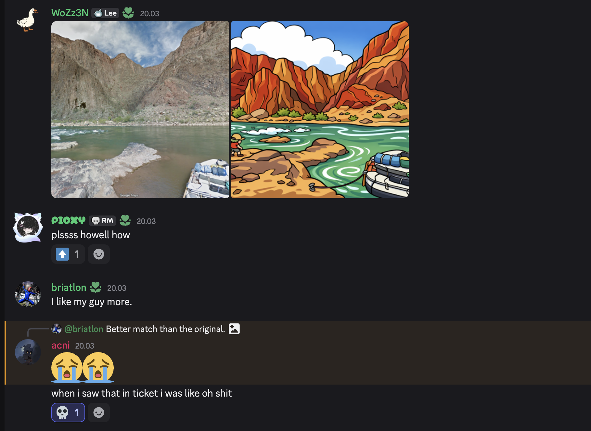

### Location 7

**Prompt:** Final stretch. Identify the street this photo is located on.
The answer is the Google Maps name, but in the format below. It is 3 words.
**Difficulty:** Hard

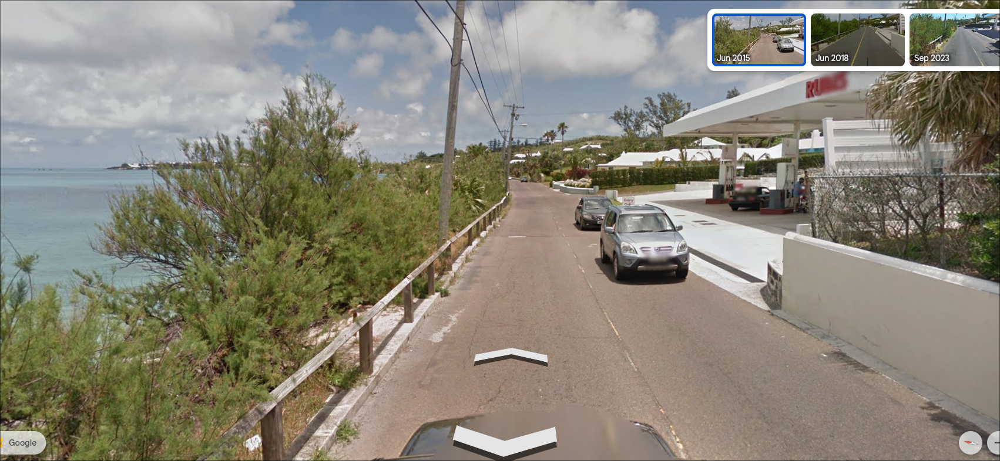

We’d spent so much time on location 6 that at this point [this last location](https://maps.app.goo.gl/1zsAiFXjhTv92Lg77) was already pinned down to the millimeter. The gas station RUBiS name gave it away and it was quite easy to lock it down, combined with more reverse image search.

> Location: N_Shore_Rd

## Final remarks

In the end we got 2nd blood and a free sightseeing raft tour down the Colorado River. Was it fun? Absolutely. Did we learn a lot? YES. Would I like to do more of these AI images challenges? Hmmmm.. It’s an interesting spin on a very popular part of OSINT, but it made me focus on things that were ultimately hallucinated. 

I’m happy we got the flag after all.

## Flag

`0xfun{0m6_br0_m16h7_b3_r41nb0l7}`

## Bonus river-raft findings

- [Pirate ship](https://www.google.com/maps/place/Grand+Canyon+National+Park/@38.0886129,-109.8879009,3a,75y,266.47h,68.05t/data=!3m8!1e1!3m6!1sCIHM0ogKEICAgIC61fCY_QE!2e10!3e11!6shttps:%2F%2Flh3.googleusercontent.com%2Fgpms-cs-s%2FAFfmt2Zj8giMKkILfEJrmTIHNJeNY61WdUbsTAZdKTPd-1sljVeHVIQnn_4Ro5a3YmHJ2rIgoOhIqAU8f0kjKO98Rg1Kayy6bjBABIm5w2Uy047iwc9wTFhaVKwV2q8JLGGTjW97f5sWYw%3Dw900-h600-k-no-pi21.945175486046367-ya41.46865886982164-ro0-fo100!7i3840!8i1919!4m6!3m5!1s0x873312ae759b4d15:0x1f38a9bec9912029!8m2!3d36.2678855!4d-112.3535253!16zL20vMGNucnI!5m2!1e1!1e4?entry=ttu&g_ep=EgoyMDI2MDIxMC4wIKXMDSoASAFQAw%3D%3D)
- [Cute circle](https://www.google.com/maps/place/Grand+Canyon/@35.814095,-113.33022,3a,75y,267.53h,90t/data=!3m8!1e1!3m6!1sCIHM0ogKEICAgICE_9T_cQ!2e10!3e11!6shttps:%2F%2Flh3.googleusercontent.com%2Fgpms-cs-s%2FAFfmt2bBQvzYQULqN5kJ7qTpDOAhLu9XdaDkAbkclyL-tddxpOs6eL-lO1Pj2Pn5n-obj05uCX4dFY1zpYcrAUWqnSrm6kiFmCO4SzPI7pgCoj_v1jS3qZ4sEHDKwGTxZa2D6wTRbDI%3Dw900-h600-k-no-pi0-ya267.527349756814-ro0-fo100!7i5760!8i2880!4m6!3m5!1s0x80cc0654bd27e08d:0xb1c2554442d42e8d!8m2!3d36.0997631!4d-112.1124846!16zL20vMGNuczU!5m2!1e2!1e4?entry=ttu&g_ep=EgoyMDI2MDIxMC4wIKXMDSoASAFQAw%3D%3D)
- [River toilet (saw lots of these)](https://www.google.com/maps/place/Flats+at+RM206/@36.0931472,-113.3232576,3a,75y,108.01h,67.8t/data=!3m8!1e1!3m6!1sCIHM0ogKEICAgIDq5aTJdA!2e10!3e11!6shttps:%2F%2Flh3.googleusercontent.com%2Fgpms-cs-s%2FAFfmt2akIOkLKTV0B6Bs8Hr19kp6_A9-S735uQVUrhU0O6P99bBs5ynVReOM50K09W-tGTCI5IibNFSITXjRNIBqBaM3zJBiFyWy9mN5vnzBvlVf0QYNyr1M6LJqW13QIZ95kvs3QZ4n%3Dw900-h600-k-no-pi22.203686176063442-ya64.00730254329183-ro0-fo100!7i8704!8i4352!4m16!1m8!3m7!1s0x80cc0654bd27e08d:0xb1c2554442d42e8d!2sGrand+Canyon!8m2!3d36.0997631!4d-112.1124846!10e5!16zL20vMGNuczU!3m6!1s0x80cc8afb61868529:0xdc513453a9ba2b1c!8m2!3d35.9953833!4d-113.3408297!10e5!16s%2Fg%2F11grtp6khj!5m2!1e4!1e2?entry=ttu&g_ep=EgoyMDI2MDIxNy4wIKXMDSoASAFQAw%3D%3D)
- [Beautiful sightseeing](https://tourmkr.com/F1uuzCmphV/43612202p&346.92h&95.69t)
